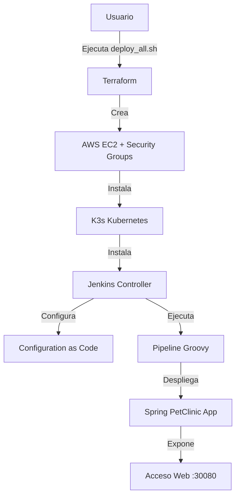

```markdown
# 🚀 Despliegue Automático DevOps: Spring PetClinic en Kubernetes

Este proyecto implementa una solución completa de **Infraestructura como Código (IaC)** y **CI/CD** para desplegar la aplicación *Spring PetClinic* en un entorno AWS.

El proceso es **100% desatendido**: desde la provisión de la infraestructura hasta el despliegue de la aplicación, pasando por la configuración de Jenkins y la ejecución automática de la pipeline.

## 🏗️ Arquitectura del Despliegue



---

## 📂 Estructura del Proyecto

Explicación detallada de los 5 ficheros clave que componen la solución:

### 1. `main.tf` (Infraestructura)

Define los recursos base en AWS.

* **Recursos:** Provisión de una instancia EC2 (`m7i-flex.large`) y Security Groups.
* **User Data:** Script de arranque que instala **K3s** automáticamente y configura el acceso al clúster.
* **Networking:** Apertura de puertos para SSH (22), API Server (6443), Jenkins (NodePort dinámico) y Aplicación (30000-32767).

### 2. `deploy.tf` (Aprovisionamiento y Configuración)

Gestiona la capa de software sobre la infraestructura.

* **Instalación:** Despliega **Helm 3** y el chart oficial de **Jenkins**.
* **JCasC:** Configura Jenkins mediante código (plugins, usuarios, seguridad) eliminando la configuración manual.
* **Seguridad:** Inyecta la pipeline codificada en **Base64** para evitar conflictos de sintaxis.
* **Automatización:** Sube el script `trigger.sh` y lo ejecuta mediante `remote-exec`.

### 3. `pipeline.groovy` (CI/CD Pipeline)

Define el ciclo de vida de la aplicación.

* **Agente Kubernetes:** Levanta Pods dinámicos con contenedores `Maven` y `Helm`.
* **Build:** Simulación de compilación y tests.
* **Helm Chart Dinámico:** Genera al vuelo los ficheros del chart (`Chart.yaml`, `values.yaml`, templates) para desplegar PetClinic.
* **Deploy:** Realiza un `helm upgrade --install` en el clúster.

### 4. `trigger.sh` (Disparador Automático)

Script encargado de iniciar el Job de Jenkins sin intervención humana.

* Espera a que el Pod de Jenkins esté en estado `Ready`.
* Descarga el **Jenkins CLI** (`jenkins-cli.jar`) desde el propio servidor.
* Ejecuta la orden de construcción usando Java nativo, evitando problemas de tokens CSRF y errores `403 Forbidden`.

### 5. `deploy_all.sh` (Orquestador)

Script maestro para el usuario final.

* **Gestión de Estado:** Importa recursos existentes para evitar duplicados.
* **Ejecución:** Lanza `terraform apply` de forma automática.
* **UX:** Filtra logs técnicos para mostrar una salida limpia en la terminal.
* **Output:** Detecta dinámicamente la IP y el puerto de Jenkins y muestra las credenciales de acceso.

---

## 🛠️ Requisitos Previos

* **Terraform** (v1.0+).
* **AWS CLI** configurado con credenciales válidas.
* Archivo de clave privada `lab-k3s-key.pem` en la raíz del proyecto.

---

## 🚀 Instrucciones de Uso

1. **Inicializar Terraform:**
```bash
terraform init

```


2. **Lanzar el Despliegue:**
Ejecuta el script maestro. El proceso tardará unos minutos.
```bash
sh deploy_all.sh

```


3. **Resultado Esperado:**
Al finalizar, verás un resumen con las credenciales y URLs:
```text
====================================================
🎉 ¡DESPLIEGUE COMPLETADO! 🎉
====================================================
🌍 URL Jenkins:      http://<IP>:3xxxx
👤 User:             admin
🔑 Pass:             <password>
🌍 URL PetClinic:    http://<IP>:30080
====================================================

```


---

## 🧹 Limpieza

Para destruir toda la infraestructura y evitar costes en AWS:

```bash
terraform destroy -auto-approve

```

---

## 🧠 Desafíos Técnicos Resueltos

* **Base64 Encoding:** Se utiliza para inyectar scripts complejos de Groovy a través de Terraform sin romper la sintaxis JSON/HCL.
* **Bypass de CSRF:** Uso de `jenkins-cli.jar` para interactuar con Jenkins de forma segura y autenticada, superando las restricciones de seguridad de la API HTTP.
* **Log Sanitization:** Redirección de `stderr` a `/dev/null` durante las esperas activas para mantener una terminal limpia.
* **Wait Conditions:** Uso de `kubectl wait` y bucles de comprobación para manejar las condiciones de carrera durante el arranque de K3s y Jenkins.

```

```
